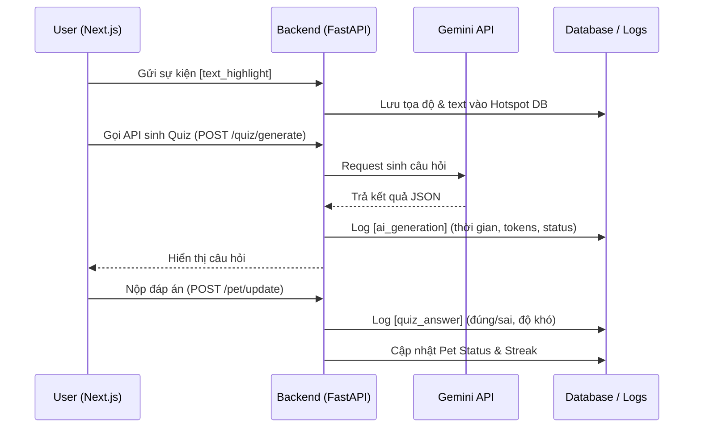

# 📈 Thiết kế Hệ thống Tracking & Telemetry (V-Pet Tutor)

Để đánh giá chính xác hiệu quả học tập và tối ưu hóa hệ thống AI, chúng ta cần một cơ chế tracking (thu thập dữ liệu) chia làm 3 tầng: **Hành vi người dùng**, **Hiệu suất AI**, và **Gamification (Game hóa)**. 

Dưới đây là ý tưởng tracking toàn diện, từ chuẩn bị cho Hackathon (MVP) đến Mở rộng (Production).

---

## 1. Các Metric (Chỉ số) Cần Track

### 📍 Tầng 1: Tracking Hành Vi (Frontend)
- `slide_view`: Học viên đang ở slide nào, dừng lại bao lâu.
- `text_highlight`: Đoạn text cụ thể học viên bôi đen. Đo lường để vẽ **Heatmap (Vùng nóng)** các kiến thức khó.
- `quiz_trigger`: Tỉ lệ hiển thị popup câu hỏi so với tỉ lệ học viên thực sự bấm "Bắt đầu làm".

### 🧠 Tầng 2: Tracking Hiệu Quả Học Tập & AI (Backend)
- `ai_generation_time`: Thời gian (latency) API Gemini phản hồi. 
- `ai_error_rate`: Tỉ lệ AI trả về lỗi (Rate Limit, từ chối trả lời do Out of Scope, Hallucination...).
- `quiz_accuracy`: Học viên trả lời Đúng/Sai (Map với độ khó của câu hỏi).
- `knowledge_gap`: Những keyword hoặc concept mà học viên trả lời sai nhiều nhất.

### 🎮 Tầng 3: Tracking Gamification (Pet)
- `exp_gained_per_day`: Số EXP thu thập được mỗi ngày.
- `pet_level_up`: Tỉ lệ học viên đạt level cao (VD: Bao nhiêu người đạt Gà Trống 🐔).
- `streak_maintained`: Số ngày học liên tục (Đánh giá mức độ giữ chân - Retention Rate).

---

## 2. Luồng Dữ Liệu (Data Flow)

---

## 3. Lộ Trình Triển Khai

> [!TIP]
> Đối với giai đoạn thi Hackathon, chúng ta không nên cài cắm các hệ thống quá phức tạp. Hãy ưu tiên **File-based Logging** hoặc **SQLite** để dễ dàng show ra cho giám khảo.

### Phase 1: MVP (Dùng cho Demo Hackathon)
- **Log Backend:** Viết thêm một Middleware trong FastAPI hoặc gọi hàm lưu log ra file `data/telemetry_logs.json`.
- **API `POST /track`**: Một API chung để Frontend bắn mọi sự kiện (Event Name, Payload, Timestamp) xuống Backend lưu lại.
- **Tạo Script Export:** Viết 1 file python ngắn (`generate_report.py`) để đọc log và in ra thống kê giả lập (Ví dụ: "70% học viên hiểu bài RAG sau khi làm quiz"). Show file này lúc thuyết trình sẽ rất ấn tượng.
giờ 
### Phase 2: Production (Thực tế)
- **Frontend Analytics:** Tích hợp `Google Analytics 4` hoặc `Mixpanel` để tracking sự kiện trên giao diện.
- **Backend Logging:** Dùng ELK Stack (Elasticsearch, Logstash, Kibana) hoặc GCP Cloud Logging để theo dõi health của AI.
- **Database Tracking:** Đẩy dữ liệu câu hỏi đúng/sai vào BigQuery để phân tích chuyên sâu năng lực học viên.

## ❓ Câu hỏi mở
Anh thấy ý tưởng triển khai luồng **Phase 1 (MVP)** bằng file JSON có hợp lý để làm tiếp ngay bây giờ không? Em có thể bổ sung API `/track` vào backend luôn nếu anh duyệt thiết kế này.
