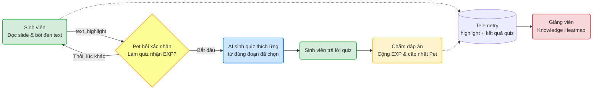

# Luồng hoạt động V-Pet Tutor

## Trình tự API

1. App tải danh sách bài giảng tĩnh bằng `GET /slide/list` và trạng thái Pet bằng `GET /pet/status`.
2. Người học bôi đen text trực tiếp trên text layer của PDF. Frontend ghi `text_highlight`; Pet dừng di chuyển và hiện speech bubble trên đầu với hai lựa chọn; chưa gọi AI.
3. Chọn **Thôi, lúc khác** chỉ ghi quyết định và kết thúc nhánh.
4. Chọn **Bắt đầu** gọi `POST /quiz/generate` với `context_text`, `slide_id`, `page_num`, `session_id`.
5. Chọn đáp án gọi một lần `POST /quiz/{quiz_id}/submit`; backend chấm, cộng EXP và ghi `quiz_answer`. Bubble trên đầu Pet biểu đạt kết quả, cảm xúc và EXP; TutorPanel chỉ giữ Quiz Card.
6. `GET /analytics/heatmap?document_id=all` tổng hợp lượt bôi đen và tỷ lệ sai thành Knowledge Heatmap thật.

## Dữ liệu minh họa Heatmap

- Dashboard trộn dữ liệu tương tác thật với bộ dữ liệu minh họa trong `backend/data/demo_heatmap.json` để các mức **Rất khó**, **Cần chú ý** và **Ổn định** dễ quan sát ngay khi demo.
- Dữ liệu minh họa luôn có nhãn `DEMO`, không được ghi vào `hotspots.json` hay `telemetry_logs.json`.
- Đặt `"enabled": false` trong `demo_heatmap.json` để dashboard chỉ hiển thị dữ liệu thật.

## Nguồn sự thật

- `slide_id` và `page_num`: do `SlideViewer` cung cấp.
- `context_text`: đoạn người học thực sự bôi đen, được giữ trong `pendingSelection` của luồng Pet.
- `session_id`: một ID ẩn danh trong `localStorage`, dùng thống nhất cho quiz, Pet và telemetry.
- Đáp án đúng và EXP: chỉ lưu/chấm ở backend; frontend không nhận đáp án trước khi nộp.
